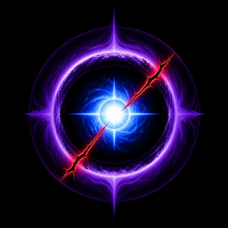
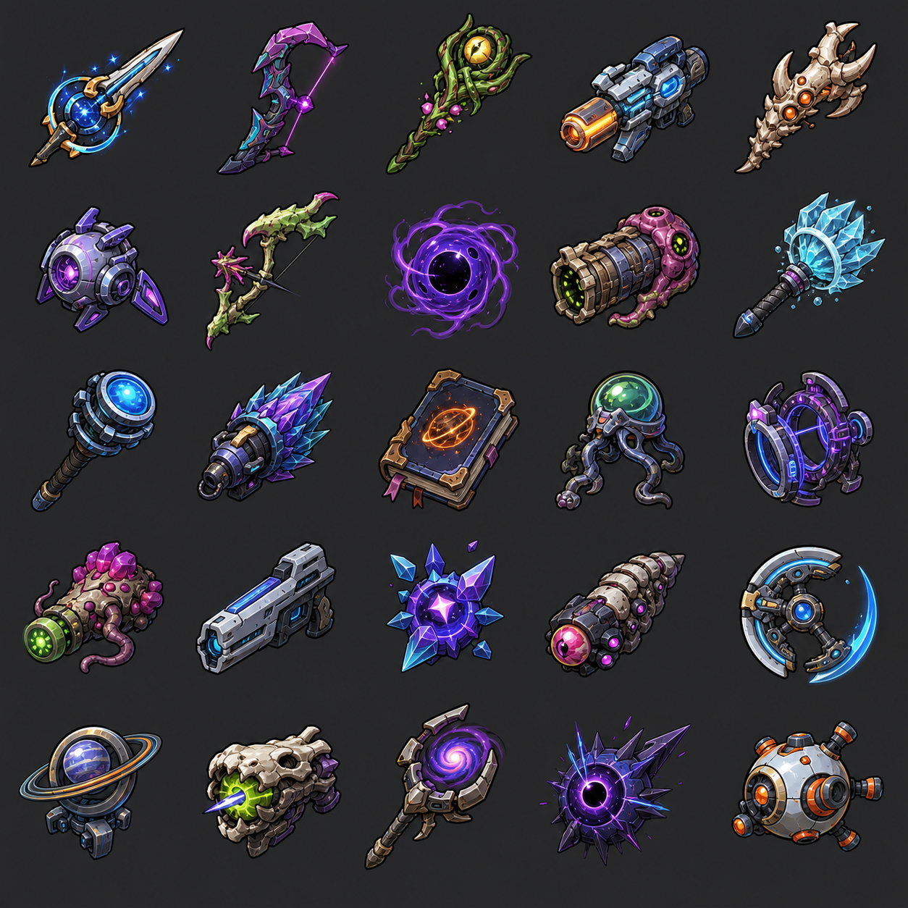

<div align="center">
  
  <h1>ROUGE HATE</h1>
  <p><strong>说出你的武器，活过这片星海。</strong></p>
  <p>一款让玩家用自然语言创造角色与攻击方式的宇宙幸存者肉鸽。</p>
</div>

[](trailer-output/rouge-hate-gameplay-trailer-final.mp4)

<p align="center">
  <a href="trailer-output/rouge-hate-gameplay-trailer-final.mp4"><strong>▶ 观看 / 下载 1080p · 25 FPS 完整宣传片</strong></a>
</p>

宣传片以一场绝境反击呈现核心玩法：自定义战斗身份、移动与虫洞冲刺、七神赐福、敌群合围与濒死压迫、自然语言 AI 锻造特写、生成武器清场、武器蓝图重构，以及追猎星群、雷暴光束、奇点环绕三种后期构筑。全部战斗画面均由浏览器中的实时 Canvas 玩法录制，配乐、逐字键盘音与转场音效为本地程序化原创。

## 你的话，会成为真正的武器

这里没有只负责聊天的 AI。

你可以输入：

> 制造一颗吞噬全屏敌人，再分裂成雷暴的微型恒星。

游戏会把这句话变成一件拥有实体外形、攻击节奏、弹道、目标策略、范围、状态与代价的武器，并立刻加入战斗。玩家明说的行为是语义契约——“自动追踪飞剑”就会离开角色主动追敌，不会被改成固定环绕；服务端只缩放数值以符合强度预算。它不会生成或执行任意代码。

开局同样可以描述自己想玩的角色，例如“挥舞重剑的恒星勇士”“用毒箭繁殖孢子的猎人”或“操纵星核与引力的星图法师”。角色会获得对应外观、初始武器、专属被动和 `Space` 技能。

## 核心体验

- **一句话构建角色**：勇士、猎人、法师三个预设，也允许完全自由输入。
- **一句话创造武器**：阶段 I 首波后、Boss 1 击杀、Boss 2 击杀，以及终极 Boss 登场 15 秒后共四次重构；一局最终拥有 1 件初始武器与 4 件自创武器。
- **输入行为真的兑现**：直线、主动追踪、折返、螺旋、蛇形、天降与四类目标选择可以自由组合，只有伤害、攻速、数量等数值受预算限制。
- **无模板 AI 攻击异变**：每第 3 次升级，玩家写下自己的想法，AI 现场设计三个不同且都符合原意的方案；方案由触发、轨迹、目标、状态与连携动作自由组合，不再从固定技能池中抽取。
- **三套独立升级演出**：普通遗物是短促的同步印记，赐福由神祇立绘与领域色裂隙全屏降临，AI 武器则把当前武器投影成动态蓝图，依次完成扫描、拆解与协议锁定。
- **216 套可审计武器特效**：9 种武器底盘 × 24 套手工视觉签名。每套都会联动改变武器轮廓、出手动作、弹体/光束、运动尾迹、命中和消散，而不是只给箭矢或激光换颜色。
- **110 件遗物与赐福**：7 位宇宙赐福者、3 个不规则遗物池、双神前置、传奇赐福、神髓强化与 8 个隐藏变身。
- **18 类宇宙星兽**：追击、远射、自爆、冲锋、孵化、护盾、狙击和环形弹幕等职责会随阶段逐渐混编。
- **可争夺的战场掉落**：敌人会掉落经验、回血组织与异星宝箱；精英/Boss 宝箱提供高级质变强化，Boss 出现时有屏幕边缘罗盘持续指路。
- **约 9 分钟一局**：三个各 3 分钟、逐渐失控的星域，随机遭遇会在中段改变战场，最终面对紫色星核 Boss“憎恨奇点”。
- **AI 不可用也能玩**：没有 API Key 时自动启用本地规则编译器，完整战斗闭环不受影响。

## 七位宇宙赐福者


<p align="center"><sub>盲星 · 白鸦 · 赤日 · 眠月 · 孢母 · 雷兽 · 观星人</sub></p>

七位神祇各自拥有 9 项专属赐福，共计 **63 项专属赐福**，覆盖普通、稀有、史诗、双神与传奇阶级。新版立绘沿用设定稿的身份、姿态与标志物，以更克制的墨线、干笔和块面阴影统一画面，减少无意义纹饰与模糊细节。每局最多结识 4 位神祇，因此同一套武器也会被推向完全不同的构筑方向；加上漂流遗物池，完整升级系统共包含 110 项手工规则化强化。

## 一局远征

1. 描述角色流派，获得初始武器与专属技能。
2. 从普通星兽群中升级，结识最多 4 位宇宙赐福者。
3. 每第 3 次升级进入一次“武器异梦”，改造已有武器的攻击形态。
4. 阶段 I 清除首波后完成第一件武器；后续构建由 Boss 节奏触发，不再重复首波流程。
5. 在第 3 星域把五件武器、遗物、双神赐福与隐藏变身组合成夸张的终局火力。
6. 击穿憎恨奇点，带着残响进入下一次远征。

## 开始游戏

需要 Python 3.10+，不需要 npm 或 pip 依赖。

```powershell
git clone https://github.com/OneYaYa/Rougehate.git
cd Rougehate
Copy-Item .env.example .env
python server.py
```

然后打开 <http://127.0.0.1:8787>。

配置 OpenAI 后可以生成更贴合愿望的角色与武器：

```dotenv
OPENAI_API_KEY=sk-...
OPENAI_MODEL=gpt-5.6-terra
```

API Key 只由本地 Python 服务读取，不会进入浏览器。暂时不配置 Key 也可以直接游玩。

## 操作

| 操作 | 按键 |
|---|---|
| 移动 | `WASD` / 方向键 / 触屏拖动 |
| 专属技能 | `Space` |
| 选择升级 | `1` / `2` / `3` 或点击卡牌 |
| 暂停 | `Esc` |
| 攻击 | 自动瞄准与自动释放 |

## 当前版本

这是一个可从开局完整游玩到最终 Boss 的浏览器原型。战绩、设置、武器图鉴和局外残响保存在浏览器本地。

目前尚未提供云存档、手柄支持、账号系统与正式发行安装包。开发服务器适合本机体验，不应不加保护地直接暴露到公网。

<details>
<summary><strong>AI 安全边界与开发验证</strong></summary>

- OpenAI Responses API + Structured Outputs，模型只能返回严格 JSON Schema 中允许的字段。
- 服务端会再次裁剪数值、校验可执行效果图，并执行 72 / 104 / 140 / 184 四档武器预算。
- 模型永远不会生成或执行 JavaScript / Python。
- AI 文案与设计不会被固定标题或技能模板替换；模型失败时使用程序化本地演示结果，保证奖励流程不断。

```powershell
python -m unittest discover -s tests -v
python -m py_compile server.py
```

</details>

<details>
<summary><strong>原创武器视觉方向</strong></summary>



这张概念表用于统一“异星生物结构、旧机械、结晶与天体环”的视觉语言；游戏内武器由模块化 Canvas 模型实时组合。

</details>

<details>
<summary><strong>重新录制宣传片</strong></summary>

导演模式位于 `?trailer=1`，只用于确定性实机录制，不会影响正常游戏。当前分镜约 49 秒，采用“爆点冷开场 → 身份定义 → 早期生存 → 七神赐福阵列 → 具体赐福效果 → 多方向追逃绝境 → AI 锻造输入 → 生成武器逆转 → 武器蓝图重构 → 三种后期构筑”的递进结构。七神片段集中展示新版原创立绘、**7 位独特的宇宙神祇 / 63 项专属赐福**，随后用“太阳的指纹”明确展示击杀残焰与范围灼烧效果；异变片段会直接展示当前武器的实时轮廓与扫描、拆解、锁定流程。绝境段由不同方向、不同速度与不同职责的敌群切断撤离路线，玩家会持续走位和冲刺，不再使用同步收缩的规则圆环。输入阶段保留 AI 锻造标题、输入框、字数与提交按钮，并让逐字键盘音与构想文字同步。反击与终局段使用为实时录制校准过的特效预算，保持清晰和稳定。

```powershell
python -m pip install numpy imageio-ffmpeg playwright
python tools\render_trailer.py
```

录制器默认调用 Windows 上已安装的 Google Chrome。

输出文件为 `trailer-output/rouge-hate-gameplay-trailer-final.mp4`，规格为 H.264 High / AAC Stereo / 1920×1080 / 25 FPS；25 FPS 与 Playwright 原生录制帧率一致，避免 25→30 转换造成的不均匀重复帧。脚本会自动裁掉录制器启动阶段、执行卡顿审计，并同步重建 README 顶部的轻量预览动图。

</details>
